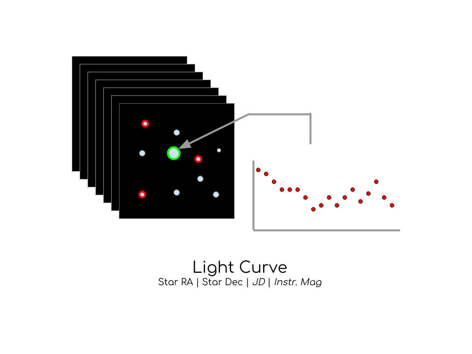

# **VSPy**

A Python based project to assist in automation of discovery and classification of variable stars.

THIS PROJECT IS STILL UNDER DEVELOPMENT.

## **Table of Contents**

* Notebooks: Holds source code for VSPy.

* docs: Contains documentation on functions and usage of project.

## **Introduction to Variable Star Hunting**

A variable star is a star whose brightness as seen from Earth (its apparent magnitude) fluctuates. To find these variable stars, we take images of the same stars over a series of time. Each of these images are in FITS format, giving us the image of the stars observed, as well as other information needed for light curve generation. Once We have a stack of FITS Images, we can calibrate the images, removing background factors, and generate the instrumental magnitude light curves for each star.

Using each light curve, we use a technique called differential photometry to determine the magnitude of the stars. By comparing the magnitude of comparison stars, we can generate a light curve for a given star. If the comparison stars happen to be constant at the time, we have the true light curve of the star, giving us information about its variability and type of star.

## **Role of VSPy**

This Project is part of the Astronomy Research Class at Phillips Academy Andover. The purpose of this project is to develop a system that would allow users to easily discover and identify existing and new variable stars in a given set of images. Parts of this library are connected to the [C-Munipack Project](http://c-munipack.sourceforge.net/). The goal of this project to provide a machine learning solution to the discovery of variable stars.

### **What does this project do**

* **Generate Light Curves from Sets of Images:** In combination with the C-Munipack Project and VSPy, users are able to extract light curves for all stars in the field of the images. With the light curves, the user can either export the data to AAVSO format or save them to the VSDB for storage and classification.

* **Determine the Period of Variable Stars:** For each star in the database, VSPy will calculate the periodogram and find the most significant period.

* **Identify and Classify Variable Stars: **This project uses feature extraction and machine learning to classify the light curves as variable and type of variability.

* **Compile data with Online DBs:** VSPy connects your data to data from Catalina Sky Survey, SIMBAD, and more to add more data to light curves.

