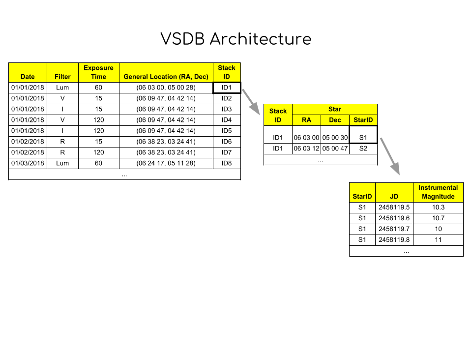

# **VSDB Architecture**

## **VSDB**

This Project is part of the Astronomy Research Class at Phillips Academy Andover.

### **Saving Set of Images**

### **Saving LC Data from VSPy**

### **Extracting Images**

### **Extracting Light Curves**

### **Print Features?**

