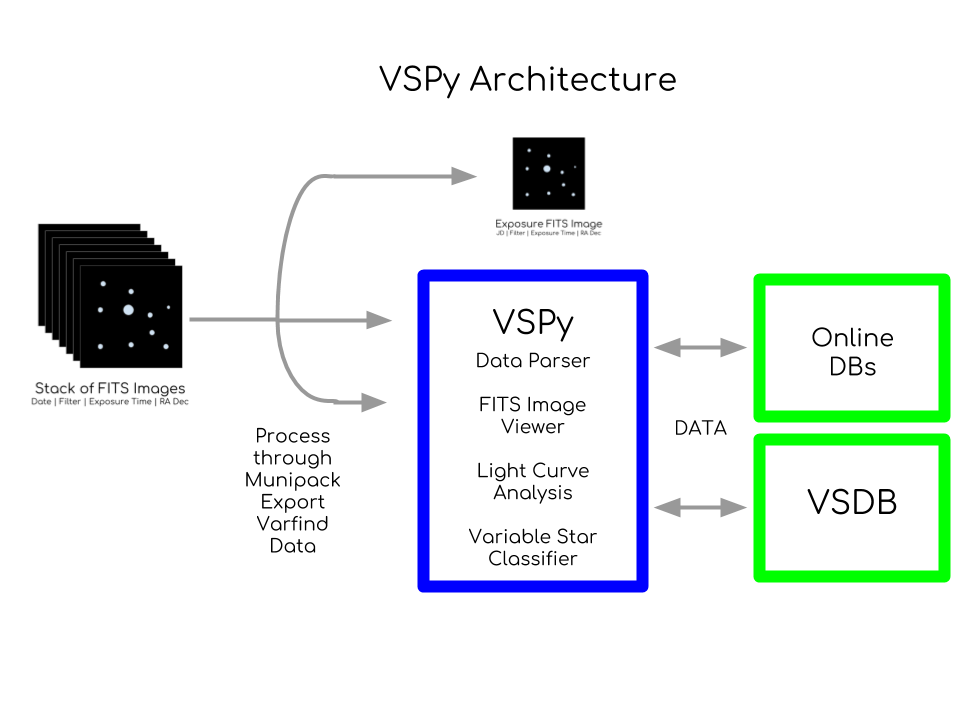
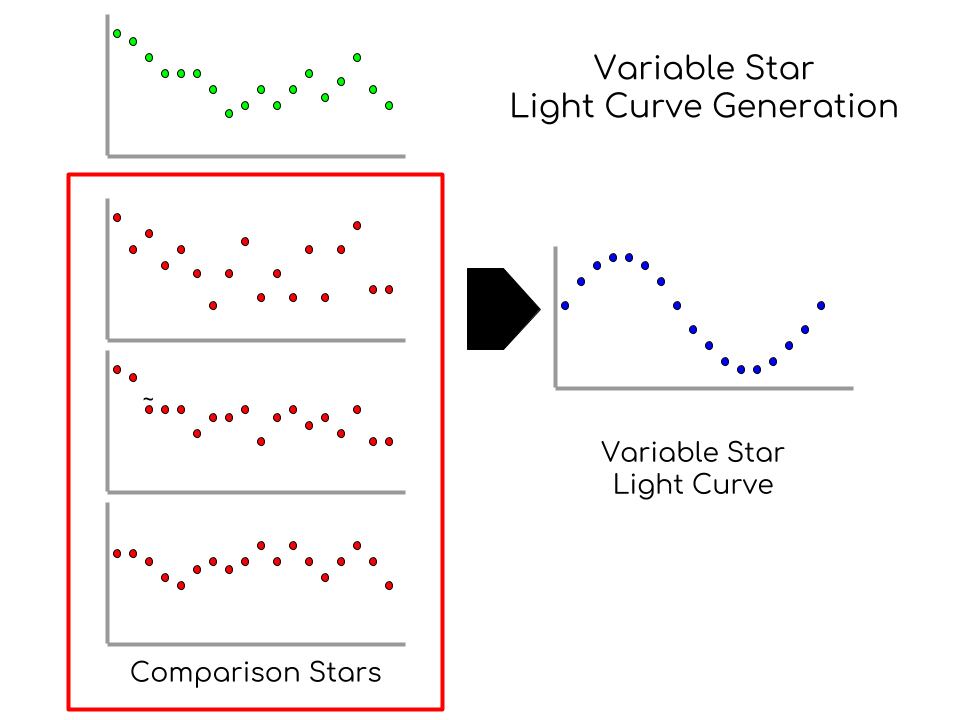

# **VSPy Software Architecture**

## **Image Processing through C-Munipack**

## **VSPy**

This Project is part of the Astronomy Research Class at Phillips Academy Andover.

### **FITS Image Viewer**

### **C-Munipack Data Parser**

### **Light Curve Analysis and Viewer**

Comp Stars and Variable LC generation

Period FInding

Visualizing and Comparing for nights

### **VSDB Interface**

### **Variable Star Classifier**

RNNs and Feature Extraction

